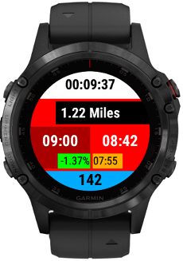
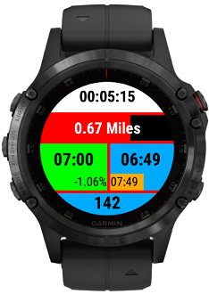
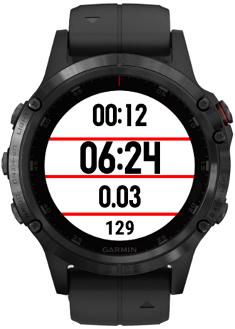
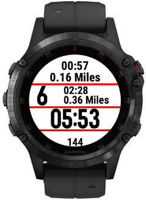
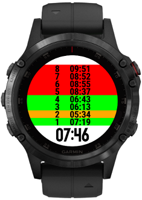
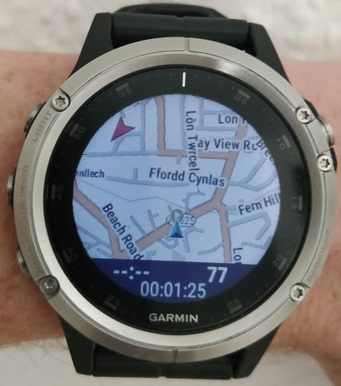
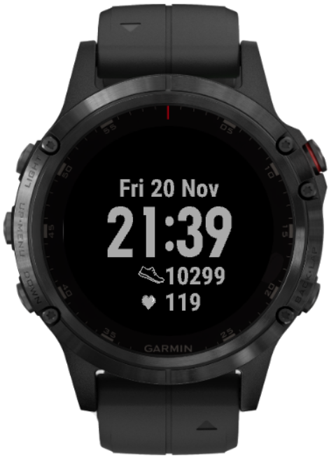
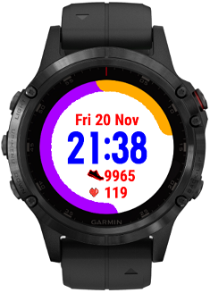
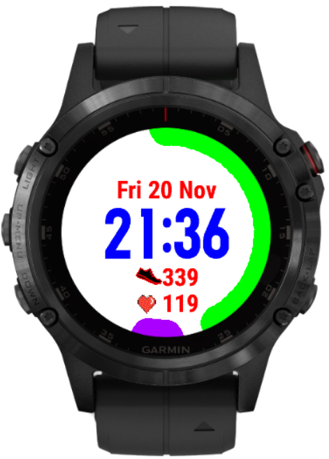
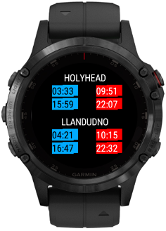

# garmin-connectiq 
Bits a pieces of monkeyc written for my garmin fenix 5 plus.

# Running Datascreen

# Interval Datascreen

# Map Overlay Datascreen

# Simple Watchface

# Tide Times Widget
