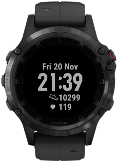
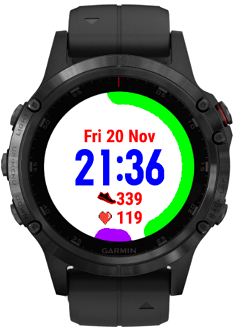

A simple watchface with time/date/hr/steps/battery. Normal view is dark background with light grey text/images, if you shake your wrist it adds a bit of colour. In active mode the purple gauge on the left shows progress towards step goal and the gauge on the right shows battery remaining.
  
Battery Saver Mode:  

  
Active Mode:  

