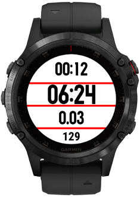

A datascreen useful for interval training. When I run hill intervals or sprint intervals, even "laps" are my efforts and odd "laps" are recoveries so I wanted a datascreen that shows different information on even & odd laps, even ones I need just the salient details of lap pace, lap duration, lap time and current heart rate. On the odd laps I can afford to spend longer looking at my watch so can show a more complicated screen. On recoveries the screen alternates every 4 seconds. The first recovery lap screen shows current recovery lap stats as well as overall time and distance and the second recovery lap screen shows average lap pace along with pace of the last 6 laps colour coded based on whether they were faster or slower than average.
  
Active Lap Screen:  

  
Main Recovery Lap Screen:  

  
Lap History Recovery Lap Screen:  
