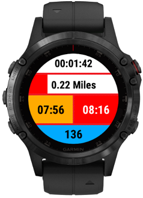

A 5 field layout suitable for garmin devices with a 240x240 resolution and heart rate data. Only really written for my own needs, this is my main datascreen for normal running activities. This will only work when the datascreen layout is set to one field.  Doesn't contain labels as that's extra data I don't need when scanning the watch quickly. Top field is timer, followed by distance in miles followed by 2 pace fields side by side, on the left is overall average pace and on the right is 10 second rolling average pace and finally the bottom field is heart rate. Field backgrounds are colour coded so I can get a rough idea without needing to read every value.