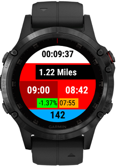

A datafield layout with 5 main fields and 2 minor fields suitable for garmin devices with a 240x240 resolution and heart rate data. Only really written for my own needs, this is my main datascreen for normal running activities. This will only work when the datascreen layout is set to one field.  Doesn't contain labels as that's extra data I don't need when scanning the watch quickly. 

Top field is timer, followed by distance in miles followed by 2 pace fields side by side, on the left is Grade Adjusted Pace and on the right is current pace and finally the bottom field is heart rate. The "minor" field below Grade Adjusted Pace is the Grade and the "minor" field below pace is overall average pace.

All the fields have colour coded backgrounds so I can tell at a glance the approximate value without reading everything, quite useful when it's raining heavily and I can't see through my glasses :P.