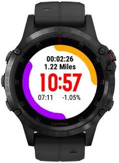

I've been doing lots of little short walks recently, my running datascreen doesn't really make sense for short local walks. Mostly I still want a watchface so I've added this datascreen which is basically a watchface with a couple of bits of activity info.